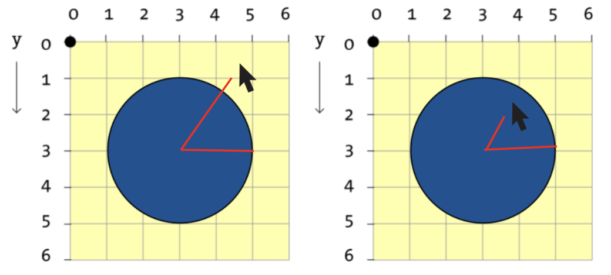

# `map` Function and Hover Events
For today's clas we will be exploring the `map` function and events that occur when the mouse hovers over a circle.

# Hover Events for Circles
A hover event for a circle is slightly more complex than a hover event for rectangle. Consider the image below:



When the mouse is *not* over the circle, a line to the mouse is larger than the radius of the circle. However, when the mouse is over the circle, the line to the mouse is *smaller* than the radius. We can code this logic with a conditional!

```pseudocode
if(radius < DistanceToMouse)
{
	// Color to fill when mouse is over

}
else 
{
	// Color to fill when mouse is NOT over

}
```

# Tasks
1. **CHALLENGE 1**: Using the `map` function, create an image where the mouseX controls the amount of red in the background and the mouseY controls the amount of green in the background.


- **STRETCH**: Have the canvas only change colors when the mouse is moving between the center of the screen and the right side.

2. **CHALLENGE 2**: Have a circle move with the mouseX and mouseY. Have the color switch at the center of the screen. Feel free to pick your own color pattern!


3. **CHALLENGE 3**: Change the color when the mouse is over the circle.


4. **CHALLENGE 4**: Create a second circle an make it a different color when the mouse is over it. **STRETCH**: Add more circles with different colors!


